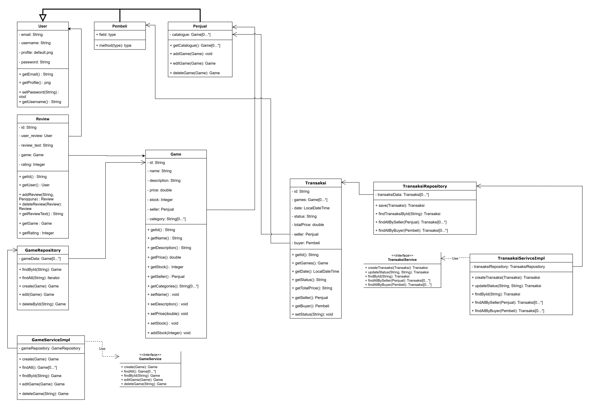

# B10 software_architecture
**C4 Model:** https://drive.google.com/file/d/1iPoVWhCQ7GrsJKCGQAS8KCda2GTB0GEM/view?usp=sharing
## 1. The current architecture of group …. , the context, container and deployment diagram

### Context Diagram

## 2. The future architecture of group …
## 3. Explanation of risk storming of group …
## 4. 
